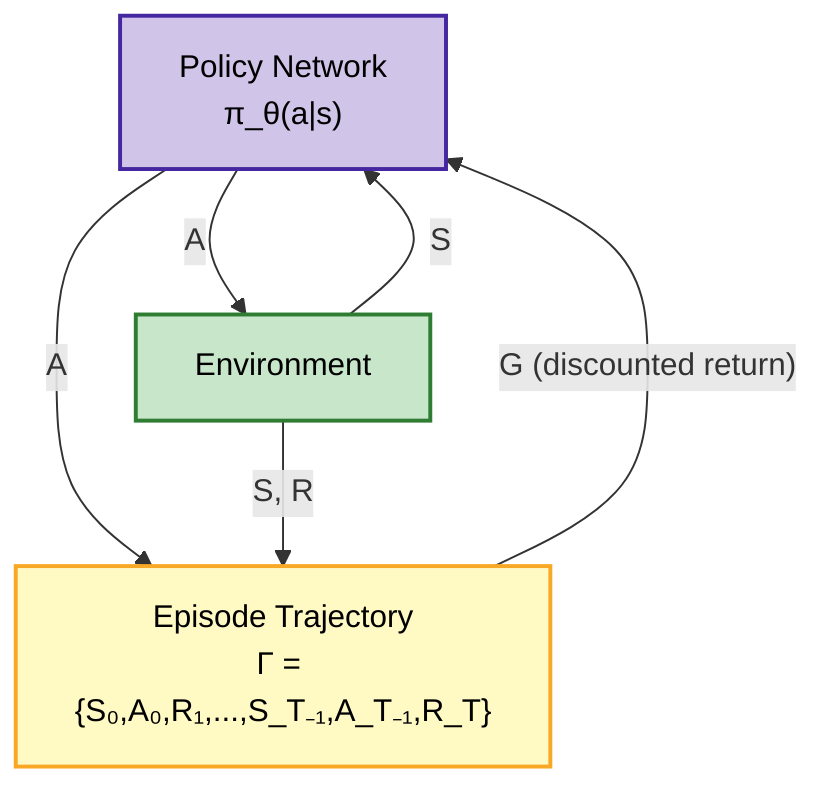
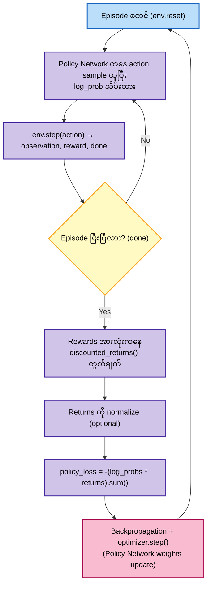

# REINFORCE (CleanRL-style) on CartPole

## Policy Network Architecture

```mermaid
flowchart LR
    A["Observation<br/>(state_size)"] --> B["Linear(state_size → 120)"]
    B --> C["ReLU"]
    C --> D["Linear(120 → 84)"]
    D --> E["ReLU"]
    E --> F["Linear(84 → action_count)"]
    F --> G["Logits"]
    G --> H["Categorical Distribution"]
    H --> I["Sampled Action"]
    H --> J["log_prob(action)"]

    classDef inputStyle fill:#bbdefb,stroke:#1565c0,stroke-width:2px,color:#000
    classDef layerStyle fill:#d1c4e9,stroke:#4527a0,stroke-width:2px,color:#000
    classDef actStyle fill:#ffe0b2,stroke:#e65100,stroke-width:2px,color:#000
    classDef outStyle fill:#c8e6c9,stroke:#2e7d32,stroke-width:2px,color:#000
    classDef distStyle fill:#fff9c4,stroke:#f9a825,stroke-width:2px,color:#000
    classDef actionStyle fill:#f8bbd0,stroke:#ad1457,stroke-width:2px,color:#000

    class A inputStyle
    class B,D,F layerStyle
    class C,E actStyle
    class G outStyle
    class H distStyle
    class I,J actionStyle
```



## Algorithm Structure (System Diagram, no Baseline)



Plain REINFORCE မှာ **Policy Network တစ်ခုတည်း**ပဲ ရှိပြီး၊ trajectory ကနေ တွက်ချက်ထားတဲ့ return $G$ ကို ဒါဆိုတိုက်ရိုက် policy loss မှာ သုံးပါတယ် (baseline network မပါ)။

## Training Algorithm Flow



## Concepts: Logits, Log_probs, Categorical, Discrete vs Continuous

### Logits

Neural network ရဲ့ output layer ကနေ တိုက်ရိုက်ထွက်လာတဲ့ raw score တွေကို **logits** လို့ခေါ်ပါတယ်။

```python
def forward(self, observation: torch.Tensor) -> torch.Tensor:
    return self.network(observation)  # ဒါက logits ပါ
```

- CartPole မှာ action 2 ခု (left/right) ရှိလို့ output size = 2 ဖြစ်ပြီး logits = `[z0, z1]` ဆိုတဲ့ real number 2 ခု ထွက်လာပါတယ်။
- Logits တွေကိုတိုက်ရိုက် probability အနေနဲ့ မသုံးနိုင်သေးပါ — negative ဖြစ်နိုင်တယ်၊ ပေါင်းလဒ်က 1 လည်း မဖြစ်ဘူး။
- `Categorical(logits=logits)` ခေါ်လိုက်ရင် အတွင်းမှာ softmax ($p_i = e^{z_i}/\sum_j e^{z_j}$) လုပ်ပြီး probability distribution ပြောင်းပေးပါတယ်။

### Log_probs

Sample ထုတ်လိုက်တဲ့ action ရဲ့ probability ကို log scale နဲ့ ပြန်ယူထားတာက **log_prob** ပါ:

```python
distribution = Categorical(logits=logits)
action = distribution.sample()
return action, distribution.log_prob(action)  # log(p(action))
```

- REINFORCE algorithm ဟာ gradient ascent ကို $\log \pi_\theta(a|s)$ ပေါ်မှာ တည်ဆောက်ထားလို့ (policy gradient theorem) log_prob လိုအပ်ပါတယ်.
- Training loop ထဲမှာ `policy_loss = -(log_probs * returns).sum()` ဆိုပြီး log_prob × return ကို maximize (loss ကတော့ minus ခံပြီး minimize) လုပ်တာဖြစ်ပါတယ် — return မြင့်တဲ့ action ရဲ့ log_prob ကို ပိုမြင့်အောင် တွန်းပေးတာပါ။
- Probability ကို တိုက်ရိုက်မသုံးပဲ log ယူတာက numerical stability အတွက်နဲ့ gradient တွက်ရတာ ပိုလွယ်လို့ပါ (log of product = sum of logs)။

### Categorical Distribution

`Categorical` ဆိုတာ logits ကို **discrete action တစ်ခုချင်းစီအတွက် probability** အဖြစ် ပြောင်းပေးတဲ့ probability distribution class ပါ (`torch.distributions.Categorical`)။ Internal အဆင့်တွေ:

1. **Softmax** — logits `[z0, z1]` ကို probability `[p0, p1]` ပြောင်း, $p_0 + p_1 = 1$ ဖြစ်အောင်။
2. **Sampling** — `p0`, `p1` weight အလိုက် dice လှိမ့်သလိုမျိုး action index ကို random ရွေးထုတ်ပေးတယ် (ဥပမာ `p0=0.8, p1=0.2` ဆိုရင် 80% ခန့် action 0 ကို ရွေးမယ်)။
3. **log_prob** — ရွေးလိုက်တဲ့ action ရဲ့ log-probability ကို ပြန်ပေးနိုင်တယ်။

### Discrete vs Continuous Action Space

| | **Discrete** | **Continuous** |
|---|---|---|
| ဥပမာ | CartPole (left/right), Atari | MuJoCo InvertedPendulum, robot control |
| Network output | Logits (action count ခု) | Mean (and often log_std) of a Gaussian |
| Distribution | `Categorical` | `Normal` (ဒါမှမဟုတ် `MultivariateNormal`) |
| Action ယူပုံ | `distribution.sample()` → integer index | `distribution.sample()` → real-valued vector, ပုံမှန် `tanh`/clip နဲ့ action range ထဲ ကန့်သတ်ပေးရ |
| Algorithm ဥပမာ | DQN, REINFORCE (ဒီ repo ရဲ့ CartPole အတွက်) | PPO, SAC, DDPG |

CartPole (discrete) နဲ့ MuJoCo cartpole (continuous) ကွာလို့ DQN/DDQN/REINFORCE (Categorical output) ကို discrete action ပဲသုံးလို့ရပြီး၊ continuous action space အတွက်တော့ Normal distribution output ထုတ်တဲ့ PPO/SAC လို algorithm တွေ လိုအပ်ပါတယ်။
