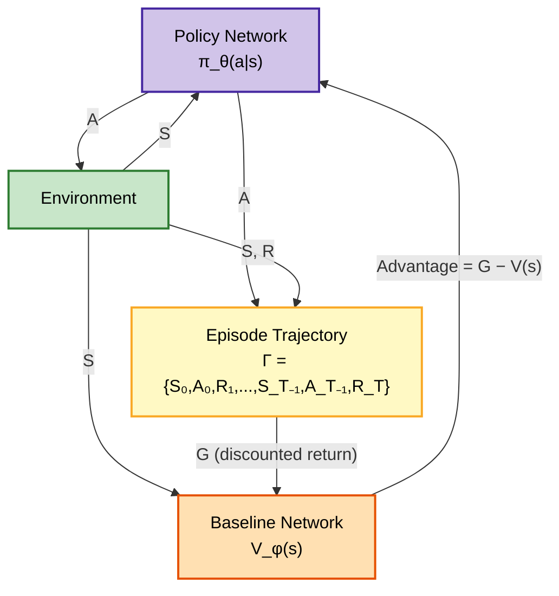
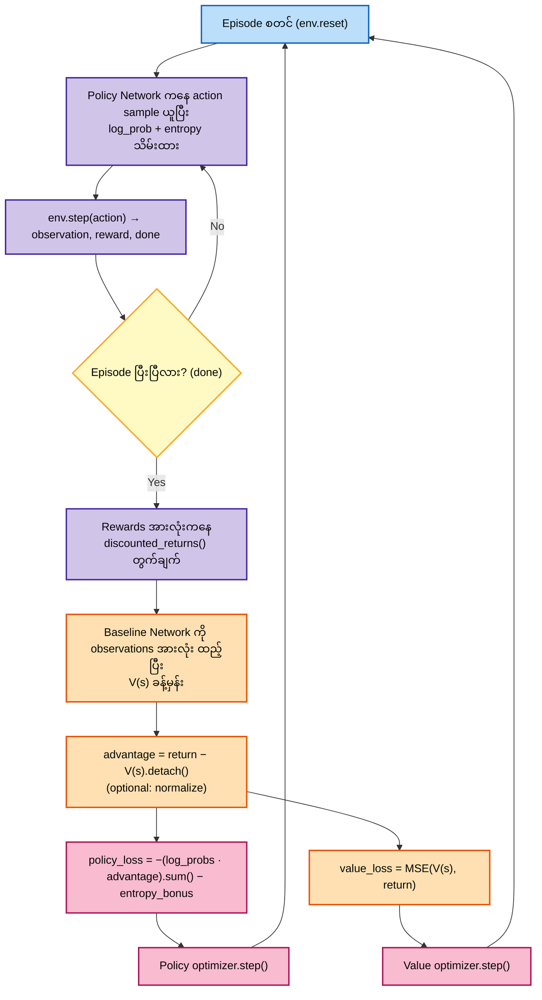

# VPG — REINFORCE with Baseline (CleanRL-style) on CartPole

## Policy Network Architecture

```mermaid
flowchart LR
    A["Observation<br/>(state_size)"] --> B["Linear(state_size → 120)"]
    B --> C["ReLU"]
    C --> D["Linear(120 → 84)"]
    D --> E["ReLU"]
    E --> F["Linear(84 → action_count)"]
    F --> G["Logits"]
    G --> H["Categorical Distribution"]
    H --> I["Sampled Action"]
    H --> J["log_prob(action)"]

    classDef inputStyle fill:#bbdefb,stroke:#1565c0,stroke-width:2px,color:#000
    classDef layerStyle fill:#d1c4e9,stroke:#4527a0,stroke-width:2px,color:#000
    classDef actStyle fill:#ffe0b2,stroke:#e65100,stroke-width:2px,color:#000
    classDef outStyle fill:#c8e6c9,stroke:#2e7d32,stroke-width:2px,color:#000
    classDef distStyle fill:#fff9c4,stroke:#f9a825,stroke-width:2px,color:#000
    classDef actionStyle fill:#f8bbd0,stroke:#ad1457,stroke-width:2px,color:#000

    class A inputStyle
    class B,D,F layerStyle
    class C,E actStyle
    class G outStyle
    class H distStyle
    class I,J actionStyle
```

## Baseline (Value) Network Architecture

```mermaid
flowchart LR
    A["Observation<br/>(state_size)"] --> B["Linear(state_size → 120)"]
    B --> C["ReLU"]
    C --> D["Linear(120 → 84)"]
    D --> E["ReLU"]
    E --> F["Linear(84 → 1)"]
    F --> G["V(s)  — state value estimate"]

    classDef inputStyle fill:#bbdefb,stroke:#1565c0,stroke-width:2px,color:#000
    classDef layerStyle fill:#d1c4e9,stroke:#4527a0,stroke-width:2px,color:#000
    classDef actStyle fill:#ffe0b2,stroke:#e65100,stroke-width:2px,color:#000
    classDef outStyle fill:#c8e6c9,stroke:#2e7d32,stroke-width:2px,color:#000

    class A inputStyle
    class B,D,F layerStyle
    class C,E actStyle
    class G outStyle
```

## Algorithm Structure (System Diagram, with Baseline)

Baseline Network (`ValueNetwork`) ဟာ state တစ်ခုစီရဲ့ expected return $V(s)$ ကို ခန့်မှန်းပြီး၊ actual return $G$ နဲ့ ကွာခြားချက် (**advantage** $A = G - V(s)$) ကို policy loss မှာ သုံးခြင်းဖြင့် plain REINFORCE ထက် gradient variance ကို လျှော့ချပေးပါတယ်။

## Training Algorithm Flow

## Concepts: Logits, Log_probs, Categorical, Discrete vs Continuous

REINFORCE ရဲ့ logits/log_probs/Categorical distribution/discrete-vs-continuous action space သဘောတရားတွေအတွက် [04_reinforce/README.md](../04_reinforce/README.md#concepts-logits-log_probs-categorical-discrete-vs-continuous) ကို ကြည့်ပါ — VPG မှာလည်း အတူတူပါပဲ၊ ကွာသည်က Baseline Network ပါလာခြင်းသာ ဖြစ်ပါတယ်။
