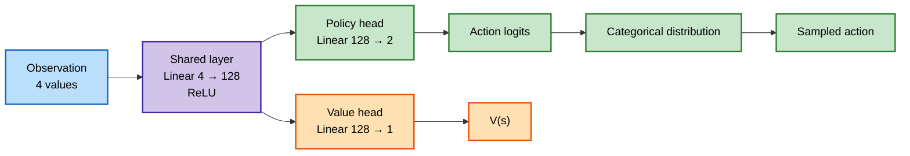
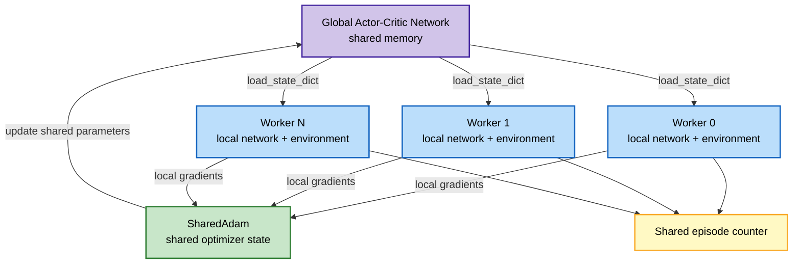
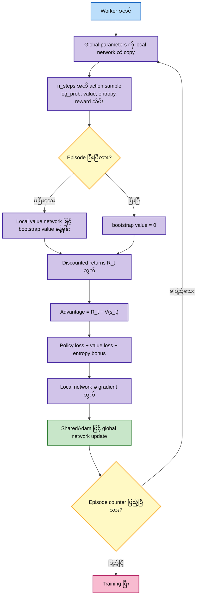

# A3C — Asynchronous Advantage Actor-Critic on CartPole

ဒီ folder ထဲက implementation ဟာ `CartPole-v1` အတွက် CleanRL-style A3C ဖြစ်ပါတယ်။ Worker process တစ်ခုစီက local actor-critic network နဲ့ rollout ကောက်ပြီး၊ global shared network ကို asynchronous gradient update လုပ်ပါတယ်။

## Algorithm Overview

A3C မှာ worker တစ်ခုစီက global network ရဲ့ parameter တွေကို local network ထဲ copy လုပ်ပြီး `n_steps` အထိ environment ကို run ပါတယ်။ Episode ပြီးသွားရင် return ကို တိုက်ရိုက်သုံးပြီး၊ episode မပြီးသေးရင် နောက်ဆုံး state ရဲ့ value estimate နဲ့ bootstrap လုပ်ပါတယ်။

Advantage ကို

$$
A_t = R_t - V(s_t)
$$

လို့တွက်ပြီး policy နဲ့ value head နှစ်ခုလုံး update လုပ်ပါတယ်။ ဒီ code မှာ

$$
R_t = r_t + \gamma R_{t+1}
$$

ဖြစ်ပြီး episode မပြီးသေးတဲ့ rollout အတွက် နောက်ဆုံး $R_{t+1}$ ကို local value network က ခန့်မှန်းပေးပါတယ်။

## Network Architecture

Observation space က CartPole ရဲ့ state vector ဖြစ်ပြီး dimension $4$၊ action space မှာ action $2$ ခု ရှိပါတယ်။ Actor နဲ့ critic တို့က hidden representation ကို share လုပ်ထားပါတယ်။



### Components

- **Shared layer:** `Linear(observation_size, 128)` followed by `ReLU`။
- **Policy head:** `Linear(128, action_count)` ဖြင့် action logits ထုတ်ပေးပြီး `Categorical(logits=...)` မှ action sample ယူပါတယ်။
- **Value head:** `Linear(128, 1)` ဖြင့် state value $V(s)$ ခန့်မှန်းပါတယ်။
- **Parameter sharing:** Global network နဲ့ worker-local network နှစ်ခုလုံးမှာ architecture တူပါတယ်။

## Global Network and Workers



Worker တစ်ခုစီဟာ global network ကို local network ထဲ copy လုပ်ပြီး rollout ကောက်ပါတယ်။ Local loss ကနေ gradient တွက်ပြီး local gradient ကို global parameter တွေဆီ ချိတ်ကာ `SharedAdam.step()` နဲ့ shared global network ကို update လုပ်ပါတယ်။ Worker များက တပြိုင်တည်း run သဖြင့် update order ကို worker တစ်ခုတည်းက မထိန်းချုပ်ပါ။

## A3C Training Flow



Loss ကို code အတိုင်း ရေးရင်

$$
L = L_{policy} + c_v L_{value} - c_e H
$$

ဖြစ်ပါတယ်။

- $L_{policy} = -\sum_t \log \pi(a_t|s_t) A_t$
- $L_{value} = \sum_t (R_t - V(s_t))^2$
- $H = \sum_t \text{entropy}(\pi(\cdot|s_t))$
- $c_v$ က `value_loss_coef`
- $c_e$ က `entropy_coef`

Gradient norm ကို `max_grad_norm` ဖြင့် clip လုပ်ပြီးနောက် shared optimizer ကို update လုပ်ပါတယ်။

## Target Network

A3C implementation မှာ **target network မရှိပါ**။

- DQN/DDQN လို target Q-network သီးခြားမသုံးပါ။
- Global actor-critic network က shared online model ဖြစ်ပါတယ်။
- Worker တစ်ခုစီမှာ global network ရဲ့ လက်ရှိ parameter snapshot ကို copy ထားတဲ့ local network ရှိပါတယ်။
- Local network ဟာ target network မဟုတ်ဘဲ rollout တွက်ရန်နဲ့ gradient တွက်ရန် သုံးတဲ့ worker copy ဖြစ်ပါတယ်။
- Episode မပြီးသေးတဲ့ rollout ကို value head နဲ့ bootstrap လုပ်တာက target network သုံးတာနဲ့ မတူပါ။

## Hyperparameters

Default values တွေကို `train_cartpole_cleanrl_a3c.py` ရဲ့ အပေါ်ဆုံး global configuration section မှာ သတ်မှတ်ထားပါတယ်။ Hyperparameter ပြောင်းလိုရင် အဲဒီ variable တွေကို တိုက်ရိုက်ပြင်ပါ။ Command-line arguments မသုံးထားပါ။

| Hyperparameter | Default | အဓိပ္ပါယ် |
|---|---:|---|
| `num_workers` | `4` | Parallel A3C worker process အရေအတွက် |
| `n_steps` | `20` | Worker တစ်ခုက update မလုပ်ခင် rollout ကောက်မယ့် အများဆုံး step အရေအတွက် |
| `learning_rate` | `1e-4` | Shared Adam optimizer learning rate |
| `gamma` | `0.99` | Discount factor |
| `entropy_coef` | `0.01` | Exploration အတွက် entropy bonus weight |
| `value_loss_coef` | `0.5` | Value loss ရဲ့ weight |
| `max_grad_norm` | `40.0` | Gradient clipping ရဲ့ maximum norm |
| `seed` | `1` | Random seed base value |
| `TOTAL_EPISODES` | `2000` | Training ရဲ့ shared episode counter limit |
| hidden size | `128` | Shared layer ရဲ့ hidden unit အရေအတွက် |

Worker တစ်ခုစီရဲ့ random seed ကို `seed + rank` အဖြစ် သတ်မှတ်ထားပါတယ်။ `rank == 0` worker ကသာ TensorBoard metrics ရေးပါတယ်။

## Run Training

```bash
cd docker/06_a3c
python3 train_cartpole_cleanrl_a3c.py
```

Worker အရေအတွက်၊ rollout length၊ learning rate သို့မဟုတ် gamma ပြောင်းလိုရင် `train_cartpole_cleanrl_a3c.py` ထဲက `NUM_WORKERS`, `N_STEPS`, `LEARNING_RATE`, `GAMMA` global variables တွေကို ပြင်ပြီး အပေါ်က command နဲ့ run ပါ။

Training ပြီးရင် model ကို `rom_cleanrl_a3c_cartpole.cleanrl_model` အဖြစ် သိမ်းပါတယ်။ TensorBoard logs တွေကို `cleanrl_a3c_cartpole_tensorboard/` ထဲမှာ ရေးပါတယ်။

## Run Evaluation

```bash
cd docker/06_a3c
python3 test_cleanrl_cartpole.py
```

Evaluation မှာ value head ကို မသုံးဘဲ policy logits ရဲ့ အမြင့်ဆုံး action ကို deterministic action အဖြစ် ရွေးပါတယ်။
