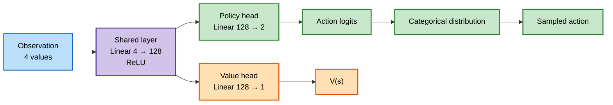
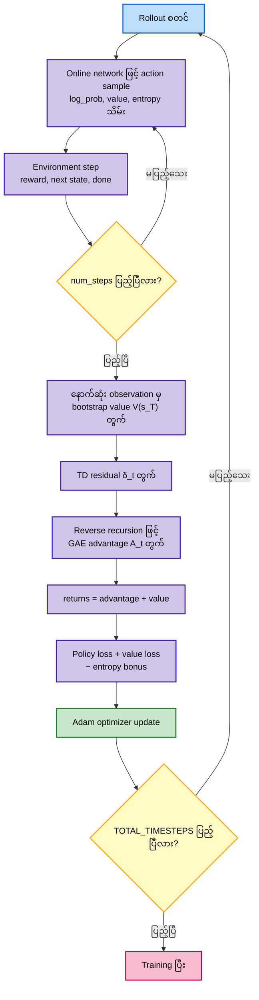

# GAE — Generalized Advantage Estimation on CartPole

ဒီ folder ထဲက implementation ဟာ `CartPole-v1` အတွက် CleanRL-style actor-critic ဖြစ်ပြီး policy gradient ကို **Generalized Advantage Estimation (GAE)** နဲ့တွက်ပါတယ်။ Single environment ကနေ `num_steps` အရှည် rollout တစ်ခုစီ ကောက်ယူပြီး update တစ်ကြိမ်လုပ်ပါတယ်။

## Algorithm Overview

GAE ဟာ one-step TD advantage နဲ့ Monte-Carlo advantage ကြားက bias-variance trade-off ကို `gae_lambda` နဲ့ ထိန်းပေးပါတယ်။ Code ထဲမှာ TD residual ကို

$$
\delta_t = r_t + \gamma V(s_{t+1})(1-d_t) - V(s_t)
$$

လို့တွက်ပြီး advantage ကို နောက်ကနေရှေ့သို့

$$
A_t^{GAE(\gamma,\lambda)} = \delta_t + \gamma\lambda(1-d_t)A_{t+1}^{GAE(\gamma,\lambda)}
$$

လို့တွက်ပါတယ်။ $d_t=1$ ဖြစ်ရင် episode ပြီးသွားတာကြောင့် နောက် state value ကို မထည့်ပါ။

Value target ကို

$$
R_t = A_t^{GAE} + V(s_t)
$$

အဖြစ် သတ်မှတ်ပြီး critic ကို train လုပ်ပါတယ်။

## Network Architecture

CartPole observation မှာ state value ၄ ခုရှိပြီး action ၂ ခု ရှိပါတယ်။ Actor နဲ့ critic က hidden representation ကို share လုပ်ထားတဲ့ network တစ်ခုတည်းကို အသုံးပြုပါတယ်။



### Network Components

- **Shared layer:** `Linear(observation_size, 128)` နှင့် `ReLU`။
- **Policy head:** `Linear(128, action_count)` ဖြင့် action logits ထုတ်ပြီး `Categorical(logits=...)` မှ action sample ယူပါတယ်။
- **Value head:** `Linear(128, 1)` ဖြင့် state value $V(s)$ ခန့်မှန်းပါတယ်။
- **Output:** `forward()` က policy logits နဲ့ value estimate နှစ်ခုကို ပြန်ပေးပါတယ်။

## Rollout and GAE Flow



Episode တစ်ခုဟာ rollout အတွင်း ပြီးသွားရင် `done` mask ကြောင့် TD residual နဲ့ GAE recursion က episode boundary ကို ဖြတ်သွားမှာ မဟုတ်ပါ။ Rollout က episode မပြီးခင် ရပ်သွားရင် နောက်ဆုံး observation ရဲ့ value ကို bootstrap လုပ်ပါတယ်။

## Loss Functions

Code ထဲက total loss က

$$
L = L_{policy} + c_v L_{value} - c_e H
$$

ဖြစ်ပါတယ်။

- $L_{policy} = -\text{mean}(\log\pi(a_t|s_t) A_t)$
- $L_{value} = \text{MSE}(V(s_t), R_t)$
- $H = \text{mean}(\text{entropy}(\pi(\cdot|s_t)))$
- $c_v$ က `value_loss_coef`
- $c_e$ က `entropy_coef`

Policy loss က GAE advantage ကို အသုံးပြုပြီး policy ကို update လုပ်ပါတယ်။ Value loss က GAE-based return target ကို အသုံးပြုပြီး critic ကို regress လုပ်ပါတယ်။ Gradient norm ကို `max_grad_norm` နဲ့ clip လုပ်ပြီး Adam optimizer ကို update လုပ်ပါတယ်။

## Target Network

ဒီ GAE implementation မှာ **target network မရှိပါ**။

- DQN/DDQN လို သီးခြား target Q-network မသုံးပါ။
- Actor နဲ့ critic နှစ်ခုလုံးဟာ တစ်ခုတည်းသော online `ActorCriticNetwork` ထဲမှာ ရှိပါတယ်။
- Rollout အဆုံးမှာ bootstrap value ကိုလည်း အဲဒီ current online network ရဲ့ value head နဲ့ပဲ တွက်ပါတယ်။
- `returns = advantages + values.detach()` မှာ `detach()` က value target ကို critic graph ထဲ ပြန်မဝင်စေဖို့ ဖြစ်ပြီး target network တစ်ခု ဖန်တီးထားတာ မဟုတ်ပါ။

## Hyperparameters

Default values တွေက `train_cartpole_cleanrl_gae.py` ရဲ့ argument parser နဲ့ training constant အတိုင်း ဖြစ်ပါတယ်။ Command line ကနေ ပြောင်းနိုင်ပါတယ်။

| Hyperparameter | Default | အဓိပ္ပါယ် |
|---|---:|---|
| `num_steps` | `20` | Update တစ်ကြိမ်မလုပ်ခင် rollout ကောက်မယ့် step အရေအတွက် |
| `learning_rate` | `7e-4` | Adam optimizer learning rate |
| `gamma` | `0.99` | Future reward discount factor |
| `gae_lambda` | `0.95` | GAE bias-variance trade-off parameter |
| `entropy_coef` | `0.01` | Exploration အတွက် entropy bonus weight |
| `value_loss_coef` | `0.5` | Value loss ရဲ့ weight |
| `max_grad_norm` | `0.5` | Gradient clipping အတွက် maximum norm |
| `seed` | `1` | Random seed |
| `cuda` | `True` | CUDA ရှိရင် GPU သုံးမသုံး သတ်မှတ်ချက် |
| `TOTAL_TIMESTEPS` | `300,000` | Training အတွက် environment step စုစုပေါင်း |
| hidden size | `128` | Shared hidden layer ရဲ့ unit အရေအတွက် |

Update အရေအတွက်ကို `TOTAL_TIMESTEPS // num_steps` နဲ့တွက်ပါတယ်။ Default အရ `300,000 // 20 = 15,000` updates ဖြစ်ပါတယ်။

## Run Training

```bash
cd docker/07_gae
python3 train_cartpole_cleanrl_gae.py
```

ဥပမာ hyperparameters ပြောင်းပြီး run ရန်:

```bash
python3 train_cartpole_cleanrl_gae.py \
    --num-steps 20 \
    --learning-rate 7e-4 \
    --gamma 0.99 \
    --gae-lambda 0.95
```

Training ပြီးရင် policy/value network ကို `rom_cleanrl_gae_cartpole.cleanrl_model` အဖြစ် သိမ်းပြီး TensorBoard logs ကို `cleanrl_gae_cartpole_tensorboard/` ထဲမှာ ရေးပါတယ်။

## Run Evaluation

```bash
cd docker/07_gae
python3 test_cleanrl_cartpole.py
```

Evaluation မှာ value head ကို မသုံးဘဲ policy logits ထဲက အမြင့်ဆုံး action ကို deterministic action အဖြစ် ရွေးပါတယ်။
