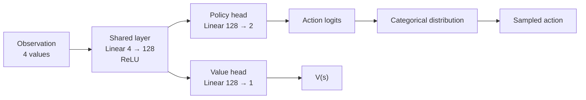
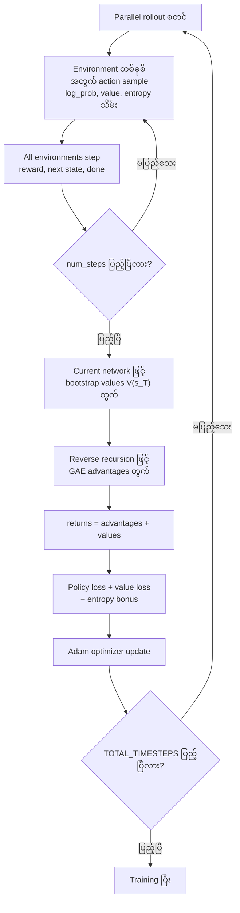

# A2C — Advantage Actor-Critic on CartPole

ဒီ folder ထဲမှာ `CartPole-v1` အတွက် synchronous **Advantage Actor-Critic (A2C)** implementation နှစ်မျိုးပါဝင်ပါတယ်။ `train_cartpole_cleanrl_a2c.py` က PyTorch နဲ့ CleanRL-style implementation ဖြစ်ပြီး parallel environments များမှ rollout ကောက်ပါတယ်။ `train_cartpole_sb3_a2c.py` က Stable-Baselines3 ရဲ့ built-in A2C ကိုသုံးထားပါတယ်။

## Algorithm Overview

A2C ဟာ A3C ရဲ့ synchronous version ဖြစ်ပါတယ်။ Environment အများကြီးကို parallel run ပြီး rollout တစ်ခုလုံးပြီးမှ batch အဖြစ် network ကို update လုပ်ပါတယ်။ ဒီ implementation မှာ Generalized Advantage Estimation (GAE) နဲ့ advantage ကိုတွက်ပါတယ်။

TD residual က

$$
\delta_t = r_t + \gamma V(s_{t+1})(1-d_t) - V(s_t)
$$

ဖြစ်ပြီး GAE advantage ကို နောက်ကနေရှေ့သို့

$$
A_t^{GAE(\gamma,\lambda)} = \delta_t + \gamma\lambda(1-d_t)A_{t+1}^{GAE(\gamma,\lambda)}
$$

လို့တွက်ပါတယ်။ $d_t=1$ ဖြစ်လျှင် episode ပြီးသွားသောကြောင့် next-state value နှင့် subsequent advantage ကိုမထည့်ပါ။

Critic အတွက် value target က

$$
R_t = A_t^{GAE} + V(s_t)
$$

ဖြစ်ပါတယ်။

## Network Architecture

CartPole observation က state values ၄ ခု၊ action space က action ၂ ခုရှိပါတယ်။ Actor နှင့် critic တို့က hidden layer ကို share လုပ်ထားသော network တစ်ခုတည်းကိုသုံးပါတယ်။



### Network Components

- **Shared layer:** `Linear(observation_size, 128)` နှင့် `ReLU`။
- **Policy head:** `Linear(128, action_count)` က action logits ထုတ်ပေးပြီး `Categorical(logits=...)` မှ action sample ယူပါတယ်။
- **Value head:** `Linear(128, 1)` က state value $V(s)$ ခန့်မှန်းပါတယ်။
- **Parallel environments:** CleanRL implementation က `SyncVectorEnv` ဖြင့် default environment ၈ ခုကို synchronous run လုပ်ပါတယ်။

## A2C Training Flow



Environment တစ်ခုက episode ပြီးသွားလျှင် ၎င်း environment အတွက် `done` mask က GAE recursion ကို episode boundary ကျော်မသွားစေပါ။ Rollout ပြီးချိန် episode မပြီးသေးသော environment များအတွက် လက်ရှိ network ၏ value head ဖြင့် bootstrap လုပ်ပါတယ်။

## Loss Functions

Total loss သည်

$$
L = L_{policy} + c_v L_{value} - c_e H
$$

ဖြစ်ပါတယ်။

- $L_{policy} = -\text{mean}(\log\pi(a_t|s_t) A_t)$
- $L_{value} = \text{MSE}(V(s_t), R_t)$
- $H = \text{mean}(\text{entropy}(\pi(\cdot|s_t)))$
- $c_v$ သည် `value_loss_coef`
- $c_e$ သည် `entropy_coef`

Policy loss က advantage မြင့်သော action များကို probability ပိုတိုးစေပြီး critic က GAE-based return target ကို fit လုပ်ပါတယ်။ Gradient norm ကို `max_grad_norm` ဖြင့် clip လုပ်ပြီး Adam optimizer ကို update လုပ်ပါတယ်။

## Target Network

A2C implementation နှစ်ခုလုံးမှာ **target network မရှိပါ**။

- DQN/DDQN လို target Q-network သီးခြားမသုံးပါ။
- Actor နှင့် critic သည် လက်ရှိ online actor-critic network ထဲမှာပင်ရှိပါတယ်။
- Rollout အဆုံး၏ bootstrap value ကိုလည်း current value head ဖြင့်တွက်ပါတယ်။
- `values.detach()` သည် value target ကို gradient graph ထဲ မပြန်ဝင်စေရန်သာဖြစ်ပြီး target network မဟုတ်ပါ။

## Hyperparameters

### CleanRL-style A2C

| Hyperparameter | Default | အဓိပ္ပါယ် |
|---|---:|---|
| `num_envs` | `8` | Parallel environments အရေအတွက် |
| `num_steps` | `20` | Update တစ်ကြိမ်မလုပ်ခင် environment တစ်ခုစီက rollout ကောက်မည့် step အရေအတွက် |
| `learning_rate` | `7e-4` | Adam optimizer learning rate |
| `gamma` | `0.99` | Future reward discount factor |
| `gae_lambda` | `0.95` | GAE bias-variance trade-off parameter |
| `entropy_coef` | `0.01` | Exploration အတွက် entropy bonus weight |
| `value_loss_coef` | `0.5` | Value loss ရဲ့ weight |
| `max_grad_norm` | `0.5` | Gradient clipping အတွက် maximum norm |
| `seed` | `1` | Random seed |
| `cuda` | `True` | CUDA ရှိလျှင် GPU သုံးမသုံး သတ်မှတ်ချက် |
| `TOTAL_TIMESTEPS` | `500,000` | Training အတွက် environment step စုစုပေါင်း |
| hidden size | `128` | Shared hidden layer ရဲ့ unit အရေအတွက် |

Update တစ်ကြိမ်မှာ transition $8 \times 20 = 160$ ခုကိုသုံးသောကြောင့် default update count သည် $500,000 // 160 = 3,125$ ဖြစ်ပါတယ်။

### Stable-Baselines3 A2C

| Hyperparameter | Default | အဓိပ္ပါယ် |
|---|---:|---|
| `num_steps` | `20` | Environment တစ်ခုစီအတွက် update မလုပ်ခင် rollout length (`n_steps`) |
| `learning_rate` | `7e-4` | Optimizer learning rate |
| `gamma` | `0.99` | Future reward discount factor |
| `gae_lambda` | `0.95` | GAE bias-variance trade-off parameter |
| `n_envs` | `8` | Parallel environments အရေအတွက် |
| `seed` | `1` | Random seed |
| `TOTAL_TIMESTEPS` | `200,000` | Training အတွက် environment step စုစုပေါင်း |

## Run Training

### CleanRL-style A2C

```bash
cd docker/08_a2c
python3 train_cartpole_cleanrl_a2c.py
```

Hyperparameters ပြောင်းပြီး run ရန်:

```bash
python3 train_cartpole_cleanrl_a2c.py \
    --num-steps 20 \
    --learning-rate 7e-4 \
    --gamma 0.99 \
    --gae-lambda 0.95
```

Training ပြီးလျှင် model ကို `rom_cleanrl_a2c_cartpole.cleanrl_model` အဖြစ်သိမ်းပြီး TensorBoard logs ကို `cleanrl_a2c_cartpole_tensorboard/` ထဲမှာရေးပါတယ်။

### Stable-Baselines3 A2C

```bash
cd docker/08_a2c
python3 train_cartpole_sb3_a2c.py
```

```bash
python3 train_cartpole_sb3_a2c.py \
    --num-steps 20 \
    --learning-rate 7e-4 \
    --gamma 0.99 \
    --gae-lambda 0.95
```

Training ပြီးလျှင် model ကို `rom_sb3_a2c_cartpole.zip` အဖြစ်သိမ်းပြီး TensorBoard logs ကို `sb3_a2c_cartpole_tensorboard/` ထဲမှာရေးပါတယ်။

## Run Evaluation

### CleanRL-style A2C

```bash
cd docker/08_a2c
python3 test_cleanrl_cartpole.py
```

Evaluation မှာ value head ကိုမသုံးဘဲ policy logits ထဲက အမြင့်ဆုံး action ကို deterministic action အဖြစ်ရွေးပါတယ်။

### Stable-Baselines3 A2C

```bash
cd docker/08_a2c
python3 test_sb3_cartpole.py
```

Stable-Baselines3 evaluation က saved model ကို load လုပ်ပြီး `deterministic=True` ဖြင့် action ရွေးပါတယ်。
