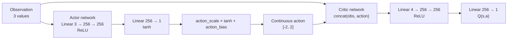
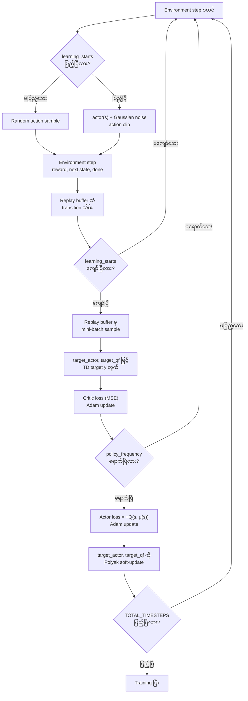

# DDPG — Deep Deterministic Policy Gradient on Pendulum

ဒီ folder ထဲမှာ `Pendulum-v1` အတွက် **Deep Deterministic Policy Gradient (DDPG)** implementation နှစ်မျိုးပါဝင်ပါတယ်။ `train_pendulum_cleanrl_ddpg.py` က PyTorch နဲ့ CleanRL-style implementation ဖြစ်ပြီး `train_pendulum_sb3_ddpg.py` က Stable-Baselines3 ရဲ့ built-in DDPG ကိုသုံးထားပါတယ်။

## ဘာကြောင့် Pendulum ကိုသုံးလဲ (MuJoCo လား၊ အရင်အတိုင်းလား)

DDPG က **continuous action space** အတွက် algorithm ဖြစ်ပါတယ် (CartPole လို discrete action environment တွေမှာသုံးလို့မရပါ)။ `Pendulum-v1` က Gymnasium ရဲ့ built-in `classic_control` environment ဖြစ်ပြီး

- Observation: 3 values (`cos(θ)`, `sin(θ)`, angular velocity)
- Action: continuous torque တစ်ခု (`[-2, 2]`)

ဆိုတဲ့ continuous action space ရှိတဲ့ environment ဖြစ်တဲ့အတွက် **MuJoCo မလိုအပ်ပါ**။ MuJoCo ကို HalfCheetah၊ Hopper၊ Walker2d၊ Ant စတဲ့ ပိုရှုပ်ထွေးတဲ့ multi-joint continuous-control robot environment တွေအတွက်သာ သုံးပါတယ်။ Pendulum ကတော့ Gymnasium install လုပ်ရင် ပါပြီးသားဖြစ်တာကြောင့် အခြား dependency (mujoco, mujoco-py, box2d) ထပ်ထည့်စရာမလိုဘဲ အရင် folder တွေလိုပဲ `gymnasium` တစ်ခုတည်းနဲ့ run လို့ရပါတယ်။

## Algorithm Overview

DDPG သည် DQN (replay buffer + target network) နှင့် policy gradient (actor-critic) ကို ပေါင်းစပ်ထားသော **off-policy, deterministic actor-critic** algorithm ဖြစ်ပါတယ်။ Discrete DQN မှာ $\max_a Q(s,a)$ ကို action အားလုံးပေါ် enumerate လုပ်တွက်ရပါတယ်၊ ဒါပေမယ့် continuous action space မှာ ဒီလိုမရနိုင်တာကြောင့် DDPG က deterministic actor $\mu(s)$ တစ်ခုကို train ပြီး $\max_a Q(s,a) \approx Q(s,\mu(s))$ လို့ approximate လုပ်ပါတယ်။

Critic (Q-network) ရဲ့ TD target ကို

$$
y = r + \gamma (1-d) Q'(s', \mu'(s'))
$$

လို့တွက်ပြီး $Q'$ နှင့် $\mu'$ တို့သည် target networks ဖြစ်ပါတယ်။

Actor ကို critic ၏ gradient ဖြင့်တိုက်ရိုက် update လုပ်ပါတယ် (deterministic policy gradient):

$$
\nabla_\theta J \approx \mathbb{E}_s\left[\nabla_a Q(s,a)\big|_{a=\mu(s)} \nabla_\theta \mu_\theta(s)\right]
$$

လက်တွေ့မှာ actor loss ကို $L_{actor} = -\mathbb{E}_s[Q(s,\mu(s))]$ အနေနဲ့ minimize လုပ်ခြင်းဖြင့် ဒီ gradient ကိုရရှိပါတယ်။

## Network Architecture

Pendulum observation က state values ၃ ခု၊ action က continuous torque တန်ဖိုး ၁ ခုရှိပါတယ်။ Actor နှင့် critic တို့သည် independent network နှစ်ခုဖြစ်ပြီး target version တစ်ခုစီပါရှိပါတယ်။



### Network Components

- **Actor `μ(s)`:** `Linear(3, 256) → ReLU → Linear(256, 256) → ReLU → Linear(256, 1) → tanh`, ပြီးရင် `action_scale`/`action_bias` ဖြင့် environment ၏ actual action range (`[-2, 2]`) ထဲ scale ပြောင်းပါတယ်။
- **Critic `Q(s,a)`:** observation နှင့် action ကို concat လုပ်ပြီး `Linear(4, 256) → ReLU → Linear(256, 256) → ReLU → Linear(256, 1)` ဖြင့် scalar Q-value ထုတ်ပေးပါတယ်။
- **Target networks:** `target_actor`, `target_qf` သည် `actor`, `qf` တို့၏ copy ဖြစ်ပြီး Polyak averaging (soft update) ဖြင့်သာ update ပါတယ်။
- **Replay buffer:** Stable-Baselines3 ၏ `ReplayBuffer` ကိုသုံးပြီး `(s, a, r, s', d)` transitions များကိုသိမ်းပါတယ်။

## DDPG Training Flow



## Loss Functions

Critic loss (MSE, DQN နှင့်ဆင်တူသော TD-error loss):

$$
L_{critic} = \left(Q(s,a) - y\right)^2, \quad y = r + \gamma(1-d) Q'(s', \mu'(s'))
$$

Actor loss (critic ၏ gradient ဖြင့် policy ကို တိုက်ရိုက် improve လုပ်ခြင်း):

$$
L_{actor} = -\mathbb{E}_s\left[Q(s, \mu(s))\right]
$$

Actor update ကို `policy_frequency` steps တစ်ခါသာ လုပ်ပြီး (delayed policy update — TD3 ကနေ ငှားယူထားသော stabilization trick), critic ကိုတော့ step တိုင်း update လုပ်ပါတယ်။

## Target Network

DQN/DDQN လို hard copy (periodic `load_state_dict`) မဟုတ်ဘဲ **Polyak averaging (soft update)** ကိုသုံးပါတယ်:

$$
\theta' \leftarrow \tau \theta + (1-\tau) \theta'
$$

- `target_actor`, `target_qf` နှစ်ခုစလုံးကို actor/critic update တိုင်း (policy_frequency အလိုက်) $\tau = 0.005$ ဖြင့် soft update လုပ်ပါတယ်။
- $\tau$ သေးလေ၊ target network ပြောင်းသွားချိန် နှေးလေဖြစ်ပြီး training ကို stable ဖြစ်စေပါတယ်။

## Exploration

Discrete DQN ရဲ့ $\epsilon$-greedy မဟုတ်ဘဲ deterministic actor output ပေါ် **Gaussian noise** ထည့်ပါတယ်:

$$
a = \text{clip}\left(\mu(s) + \mathcal{N}(0, \sigma \cdot \text{action\_scale}), a_{low}, a_{high}\right)
$$

$\sigma$ သည် `exploration_noise` (default `0.1`) ဖြစ်ပြီး `learning_starts` မပြည့်ခင်တော့ replay buffer ကို warm-up လုပ်ဖို့ လုံးဝ random action များကိုသာသုံးပါတယ်။

## Hyperparameters

### CleanRL-style DDPG

| Hyperparameter | Default | အဓိပ္ပါယ် |
|---|---:|---|
| `learning_rate` | `3e-4` | Actor/critic Adam optimizer learning rate |
| `buffer_size` | `100,000` | Replay buffer ထဲ သိမ်းနိုင်သော transition အရေအတွက် |
| `gamma` | `0.99` | Future reward discount factor |
| `tau` | `0.005` | Target network Polyak soft-update coefficient |
| `batch_size` | `256` | Update တစ်ကြိမ်လျှင် replay buffer မှ sample လုပ်မည့် transition အရေအတွက် |
| `exploration_noise` | `0.1` | Actor output ပေါ် ထည့်မည့် Gaussian noise standard deviation |
| `learning_starts` | `5,000` | Update စမလုပ်ခင် random action ဖြင့် warm-up လုပ်မည့် step အရေအတွက် |
| `policy_frequency` | `2` | Actor + target networks update လုပ်မည့် interval (critic ကတော့ step တိုင်း) |
| `seed` | `1` | Random seed |
| `cuda` | `True` | CUDA ရှိလျှင် GPU သုံးမသုံး သတ်မှတ်ချက် |
| `TOTAL_TIMESTEPS` | `100,000` | Training အတွက် environment step စုစုပေါင်း |
| hidden size | `256` | Actor/critic hidden layer ရဲ့ unit အရေအတွက် |

### Stable-Baselines3 DDPG

| Hyperparameter | Default | အဓိပ္ပါယ် |
|---|---:|---|
| `learning_rate` | `1e-3` | Optimizer learning rate |
| `gamma` | `0.99` | Future reward discount factor |
| `tau` | `0.005` | Target network Polyak soft-update coefficient |
| `exploration_noise` | `0.1` | `NormalActionNoise` standard deviation |
| `seed` | `1` | Random seed |
| `TOTAL_TIMESTEPS` | `50,000` | Training အတွက် environment step စုစုပေါင်း |

## Run Training

### CleanRL-style DDPG

```bash
cd docker/09_ddpg
python3 train_pendulum_cleanrl_ddpg.py
```

Hyperparameters ပြောင်းပြီး run ရန်:

```bash
python3 train_pendulum_cleanrl_ddpg.py \
    --learning-rate 3e-4 \
    --gamma 0.99 \
    --tau 0.005 \
    --exploration-noise 0.1
```

Training ပြီးလျှင် model ကို `rom_cleanrl_ddpg_pendulum.cleanrl_model` အဖြစ်သိမ်းပြီး TensorBoard logs ကို `cleanrl_ddpg_pendulum_tensorboard/` ထဲမှာရေးပါတယ်။

### Stable-Baselines3 DDPG

```bash
cd docker/09_ddpg
python3 train_pendulum_sb3_ddpg.py
```

```bash
python3 train_pendulum_sb3_ddpg.py \
    --learning-rate 1e-3 \
    --gamma 0.99 \
    --tau 0.005 \
    --exploration-noise 0.1
```

Training ပြီးလျှင် model ကို `rom_sb3_ddpg_pendulum.zip` အဖြစ်သိမ်းပြီး TensorBoard logs ကို `sb3_ddpg_pendulum_tensorboard/` ထဲမှာရေးပါတယ်။

## Run Evaluation

### CleanRL-style DDPG

```bash
cd docker/09_ddpg
python3 test_cleanrl_pendulum.py
```

Evaluation မှာ exploration noise မထည့်ဘဲ actor output ကိုတိုက်ရိုက် deterministic action အဖြစ်သုံးပါတယ်။

### Stable-Baselines3 DDPG

```bash
cd docker/09_ddpg
python3 test_sb3_pendulum.py
```

Stable-Baselines3 evaluation က saved model ကို load လုပ်ပြီး `deterministic=True` ဖြင့် action ရွေးပါတယ်။
